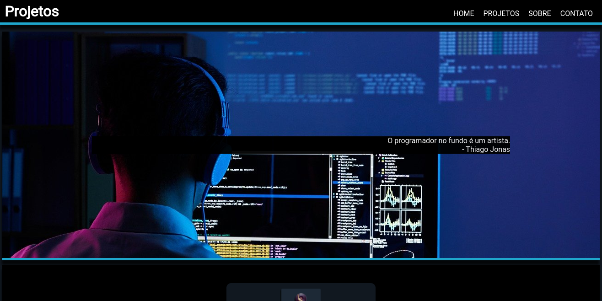
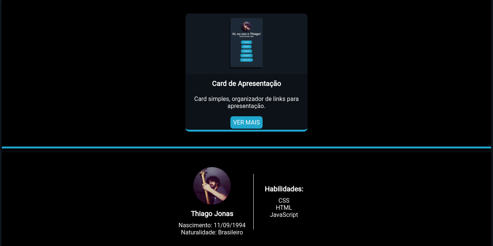
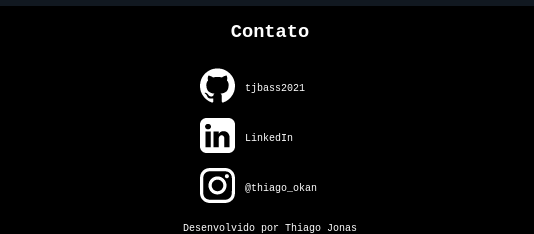
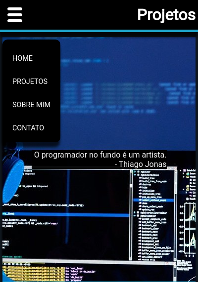
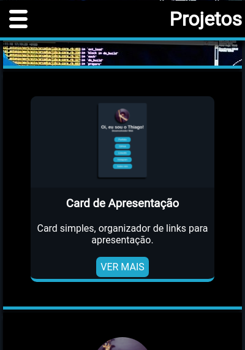
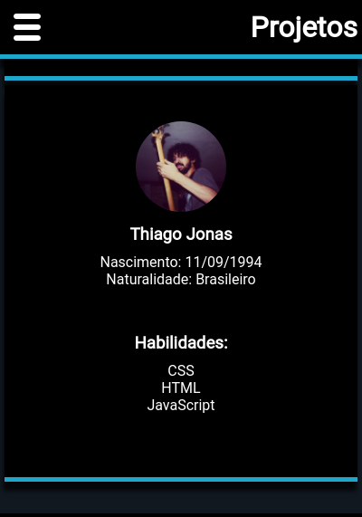
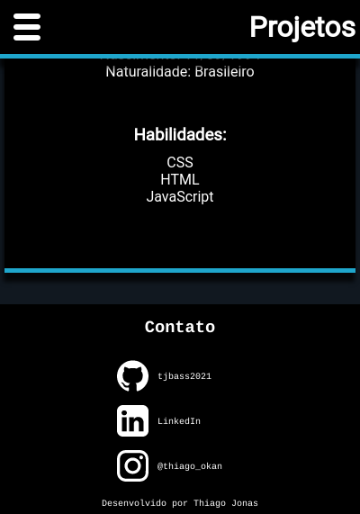

# Construção do meu Portfólio
---

Estou construíndo o site para o meu portfólio já aplicando o pouco que 
aprendi de HTML e CSS. O código, como todo bom código de iniciante, tem 
pouca ou praticamente nenhuma organização. Então, defensores das boas
práticas me perdoem :D.

---

## Home Page

A página principal é subdividida em três seções: imagem de apresentação com uma frase,
projetos com links que levarão a página do respectivo projeto com maiores explicações e
área sobre mim e minhas skills de programador.

## Responsividade

O site possui responsividade e um menu oculto lateral acionado por um botão do lado esquerdo.

---

Por enquanto é isto. Ainda serão implementadas as páginas com o conteúdo informativo dos projetos.

---
